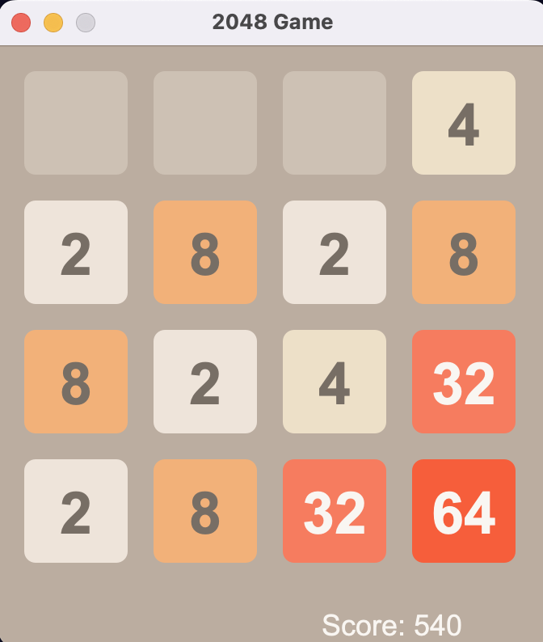

# 2048 Game

Java project replicating the popular 2048 game. This project implements the game's logic and functionality, along with extensive JUnit5 testing to ensure proper handling of edge cases.

## Installation
- Clone the repository
- Open the project in your preferred Java IDE.

## Usage
- Run the `Main` class to start the game.

## File Structure
- `src/`: Contains the source code files.
- `docs/`: Documentation files.

## Acknowledgements
- [Original 2048 Game](https://play2048.co/)
